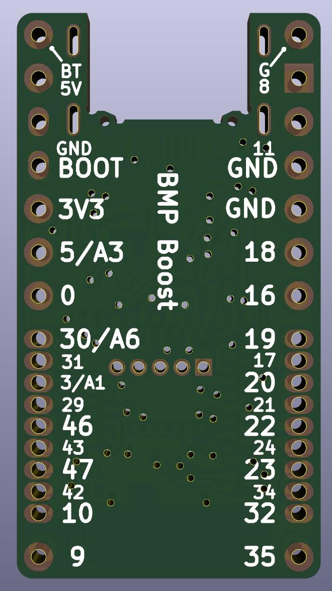

# BMP Boost

## 概要

BMP Boostは、3VのDC-DC昇圧コンバータを搭載したnRF52開発ボードです。電池一本（0.7V以上）で動作可能で、キーボードやその他の低消費電力ワイヤレスプロジェクト向けに設計されています。

## 特徴

- 3VのDC-DC昇圧コンバータ内蔵で電池一本（0.7V～）から動作可能
- ZMKまたはBLE Micro Pro用のQMKで動作可能
- 追加IOが必要な場合は、コンスルーのピンを差し替えて一部をハーフピッチにして拡張可能（ZMKのみ）

## ピン配置

### 電源コネクタ

| ラベル | 機能                                   |
| ------ | -------------------------------------- |
| BT     | 電源入力(0.7~3.3V)、AIN4で電圧測定可能 |
| G      | 電源入力GND                            |

### Pro Micro互換コネクタ

| ピン番号 | ラベル | GPIO番号 | 機能                                          |
| -------- | ------ | -------- | --------------------------------------------- |
| 1        | 8      | P0.08    | GPIO                                          |
| 2        | 11     | P0.11    | GPIO                                          |
| 3        | GND    |          | GND                                           |
| 4        | GND    |          | GND                                           |
| 5        | 18     | P0.18    | GPIO                                          |
| 6        | 16     | P0.16    | GPIO                                          |
| 7        | 19     | P0.19    | GPIO                                          |
| 8        | 20     | P0.20    | GPIO                                          |
| 9        | 22     | P0.22    | GPIO                                          |
| 10       | 23     | P0.23    | GPIO                                          |
| 11       | 32     | P1.00    | GPIO                                          |
| 12       | 35     | P1.03    | GPIO                                          |
| 13       | 9      | P0.09    | GPIO                                          |
| 14       | 10     | P0.10    | GPIO                                          |
| 15       | 47     | P1.15    | GPIO                                          |
| 16       | 46     | P1.14    | GPIO                                          |
| 17       | 3/A1   | P0.03    | GPIO/AIN1                                     |
| 18       | 30/A6  | P0.30    | GPIO/AIN6                                     |
| 19       | 0      | P0.00    | GPIO                                          |
| 20       | 5/A3   | P0.05    | GPIO/AIN3                                     |
| 21       | 3V3    |          | DC-DCコンバータ出力(3V, P0.04がHのときのみ外部出力有効)                       |
| 22       | BOOT   |          | GNDに落として電源を入れるとブートローダを起動 |
| 23       | GND    |          | GND                                           |
| 24       | 5V     |          | 電源入出力(5V)                                |

### 追加IO

|ラベル|GPIO番号|
|-|-|
|17|P0.17|
|21|P0.21|
|24|P0.24|
|34|P1.02|
|42|P1.10|
|43|P1.11|
|29|P0.29|
|31|P0.31|

## サンプル

- [zmk-component-bmp-boost](https://github.com/sekigon-gonnoc/zmk-component-bmp-boost)

## 注意事項

- BMPと違いI2Cのレベル変換機能はありません。
- BMPとは電源ピン(3V)の機能が異なります。
- 仕様等は予告なく変更となる場合があります。
