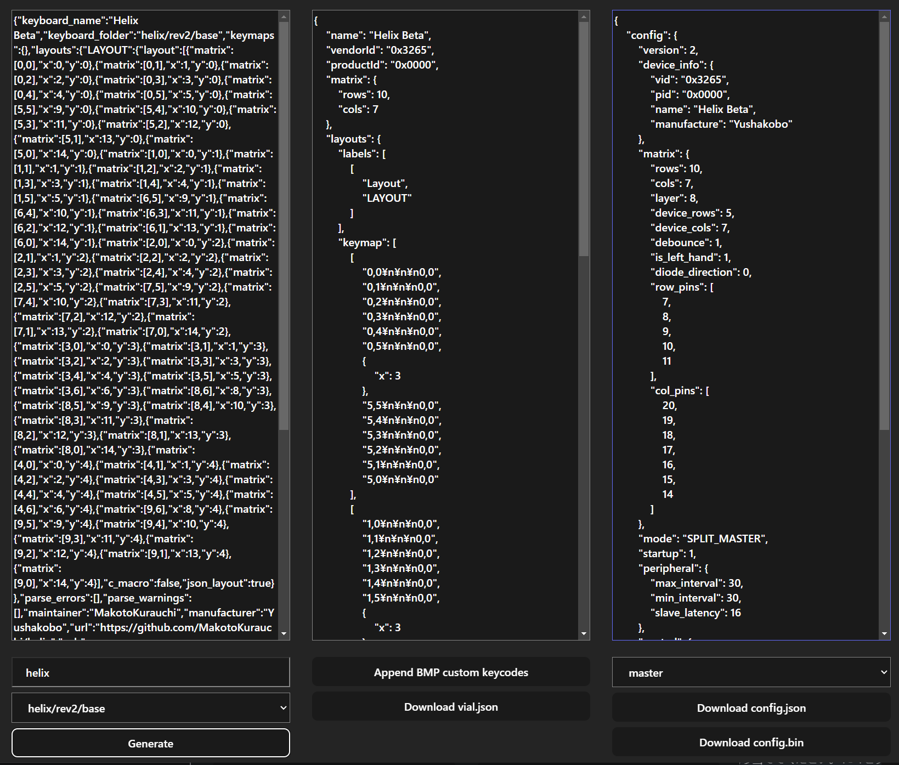

# 設定について

- [BLE Miro Proを更新して設定ファイルを書き込む手順](#ble-miro-proを更新して設定ファイルを書き込む手順)
  - [bmp-vial対応の設定ファイルを用意する](#bmp-vial対応の設定ファイルを用意する)
  - [BLE Micro Proに設定ファイルを書き込む](#ble-micro-proに設定ファイルを書き込む)
- [BLE Miro Pro Web Configuratorに登録するための手順](#ble-miro-pro-web-configuratorに登録するための手順)
  - [vial.jsonとconfig.jsonの用意](#vialjsonとconfigjsonの用意)
  - [デフォルトキーマップ用binファイルを用意する](#デフォルトキーマップ用binファイルを用意する)
  - [2種類のjsonファイルとデフォルトキーマップ用binファイルを登録する](#2種類のjsonファイルとデフォルトキーマップ用binファイルを登録する)

## BLE Miro Proを更新して設定ファイルを書き込む手順

### bmp-vial対応の設定ファイルを用意する

設定ファイルは2種類のjsonファイルと、jsonから生成される1つのbinファイルがあります。
これらの設定ファイルは[bmp-vial-config-generator](https://sekigon-gonnoc.github.io/bmp-vial-config-generator/)を利用することでQMKのinfo.jsonから変換できます。そのため、すでにPro Micro用のファームウェアが用意されていれば、単純な変換作業のみでBLE Micro Pro用の設定も用意できます。

* vial用jsonファイル(vial.json)
  * vial用の設定ファイルです
* config用jsonファイル(config.json)
  * BLE Micro Pro用の設定ファイルです。従来とは一部の項目が変わっています
* 書き込み用binファイル(config.bin)
  * vial.jsonとconfig.jsonから生成された書き込み用のバイナリファイルです

1. 左側のテキストボックスにQMKのinfo.jsonを記入する
   1. QMK公式のリポジトリにinfo.jsonが存在する場合はテキストボックス下部にあるリストから選択できます。
   1. info.jsonの中にはmatrixのピンと配置の情報が必要です。これらの情報がconfig.hやLAYOUTマクロに記入されている古いファームウェアでは`qmk info -kb <keyboard> -f json`コマンドを使用するとinfo.jsonを生成できる場合があります。
2. 左下の`Generate`ボタンをクリックしてvial.jsonとconfig.jsonを生成する
   1. 自動生成されたvial.jsonでは内容が不十分な場合はテキストボックスの中身を書き換えてください
3. 中央下の`Append BMP custom keycodes`ボタンをクリックして、BLE Micro Pro用のカスタムキーコードリストをvial.jsonに追加する
4. 分割キーボードの場合は右下のリストからconfig.jsonの対象(master, slave, lpme)を選択する
   1. 自動生成されたconfig.jsonでは内容が不十分な場合はテキストボックスの中身を書き換えてください。通常のマトリクスであればinfo.jsonからの自動変換で十分な場合が多いですが、duplex-matrixは修正が必要な場合があります。→[config.jsonの説明](edit_config_file.md)
5. `Download config.bin`ボタンをクリックしてconfig.binを生成・ダウンロードする

### BLE Micro Proに設定ファイルを書き込む 

マスストレージ経由で書き込む場合は下記の手順で作業してください。

1. BLE Micro Proのアプリケーションが起動していることを確認する
   1. マスストレージとして認識されているBLE Miro Proを開き、中にCONFIG.BINがあることを確認する
2. 用意したconfig.binをドラッグアンドドロップして書き込む（ファイル名は任意）
3. 書き込み完了後に電源を再投入して、デバイス名が書き込んだキーボードに変わっていることを確認する

[BLE Micro Pro Web Configurator](https://sekigon-gonnoc.github.io/BLE-Micro-Pro-WebConfigurator/)から設定を書き込むこともできます。

* `Edit config`メニューを選択してください。
* キーボードリストから`Upload your own`を選択してください。
* `Update`をクリックするとファイルダイアログが表示されます。作成したbinファイルを選択してください。
* USBデバイスへのアクセスを求めるポップアップが表示されます。
* キーボードを選択して`接続`をクリックすると書き込みが始まります。
  * どのデバイスがBLE Micro Proか分からない場合はUSBケーブルを抜き差ししてデバイス一覧の変化を確認してください。
  * ポップアップにキーボードが表示されない場合はファームウェアの書き込みができていないので、最初のステップからリトライしてください。
* 書き込みが成功したら次のステップに進んでください。
  * 数十秒待っても書き込みが完了しなかったらブラウザをリロードしてUSBケーブルを抜き差してからリトライしてください。

|  |  |  |
| ------------------ | -------------------- | ------------------ |

## BLE Miro Pro Web Configuratorに登録するための手順

Vial対応の設定ファイルをBLE Micro Pro Web Configuratorに登録したい方は追加で以下の手順の実施をお願いします。該当キーボードの作者以外の方でもプルリクエストを作成していただいて構いません。

1. [bmp-vial-config-generator](https://sekigon-gonnoc.github.io/bmp-vial-config-generator/)でvial.jsonとconfig.jsonを生成し、ダウンロードする
1. (任意)デフォルトキーマップ用binファイルを用意する
1. 2種類のjsonファイルとデフォルトキーマップ用binファイルを[bmp-vial-config/](https://github.com/sekigon-gonnoc/BLE-Micro-Pro/tree/master/bmp-vial-config)フォルダに保存し、プルリクエストを作成する

### vial.jsonとconfig.jsonの用意

[bmp-vial-config-generator](https://sekigon-gonnoc.github.io/bmp-vial-config-generator/)で設定を作成したら、それぞれの列の下部にある`Download *.json`ボタンをクリックして各jsonファイルをダウンロードしてください。

### デフォルトキーマップ用binファイルを用意する

EEPROMリセット時に反映されるデフォルトキーマップの設定ファイルを用意してください。

1. RemapまたはVialを使ってデフォルトにしたいキーマップをキーボードに書き込む
2. BLE Micro Proのマスストレージを開きEEPROM.BINをPCにコピーする
3. コピーしたEEPROM.BINの名前を変更する
   1. 名前はキーボード設定用のconfig.binに合わせて`<キーボード名>_default.bin`としてください
4. ファイルをBLE Micro Proに書き戻し、EEPROMをリセットしたときに意図通りのキーマップになっていることを確認する

### 2種類のjsonファイルとデフォルトキーマップ用binファイルを登録する

BLE Miro Proのリポジトリの [bmp-vial-config/](https://github.com/sekigon-gonnoc/BLE-Micro-Pro/tree/master/bmp-vial-config)フォルダにvial.json, config.json, default.binファイルを追加してプルリクエストを作成してください。
