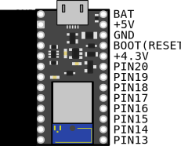

# 無線対応の自作キーボードを設計する

## ハードウェア概要

[ハードウェア仕様](features.md#ハードウェア仕様)

### 使用上の注意点

Pro Microとの互換性を意識して設計されていますが、以下の点にご注意ください。

- 入出力は3.3Vです。ただし、5・6番ピン(SDA・SCL)のみFETによるレベルシフト回路を実装しています。
  - **5・6番ピン以外は5Vトレラントではありません**
  - 5・6番ピンはNeoPixel系のLEDの駆動には使えません

- RAWピンの最大電圧は5Vです。

- コンスルーに対応しているため、はんだ付けせずに基板に取り付けられます。

## 電源

- USBコネクタの横にあるBATピン、あるいはUSBコネクタ、RAWピン、VCCピンから電源供給できます。
  - BATピン (1.7V--3.6V)
  - RAW or VCC (3V--5V)
    - ただし、RAW, VCC >= BATのときのみ

- バッテリー駆動する場合は1.7Vから3.6Vの電源が必要です。したがってLiPoバッテリーを使用する場合は別途レギュレータをつけて電圧を下げてください。

- 特に分割型のキーボードをコイン電池で駆動する場合は、許容電流量を確保するため、電池を並列接続することをおすすめします。
このとき、ショットキーバリアダイオードを間に入れるのを忘れないでください。

  

  
解説

    分割型の場合、BLE Micro Proの平均電流量は300uAくらいになる場合があります。コイン電池の定格連続電流は200uAくらいのため、電池を並列にして定格以下に抑えられるようにします。このとき、並列に繋いだ電池に電位差があると電池間で電流が流れてしまうため、ダイオードを挟んで防止します。ダイオードにはショットキーバリアダイオードという電圧降下が小さいダイオードを使うことで、電池の電圧が下がってきてもギリギリまで使い切ることができます。
  

- コイン電池で駆動する場合には前述のダイオードのあとに100uFくらいの積層セラミックコンデンサを入れてください。

  

  
解説

  BLE Micro Proが無線通信するとき、瞬間的に6mAくらいの電流を必要とします。コイン電池は内部抵抗が大きいのでこの電流で電圧が瞬間的に下がってしまい、必要な電圧を下回ってBLE Micro Proがリセットしてしまう可能性があります。コンデンサを入れることでこのピークを鈍らせてリセットを防止します。
  

コイン電池をつかった電池基板の例は[こちら](https://github.com/sekigon-gonnoc/BLE-Micro-Pro/tree/master/CoinCellHolder)

## 配線

- 回路図上の配線はPro Microとほぼ同じです。

  - PIN13を使わないようにすると、12ピンのコンスルーだけで必要なピンをすべて基板に接続できます。

    

     赤枠の部分で基板と接続すると、左上のGNDは他のピンで接続されているため、右下のPIN13以外はすべて接続された状態になります。

  - RAWと4V3は繋がないで、NeoPixelなどのLEDの電源には4V3を使ってください。

  - LPME-IOに対応させる場合は左右の有線通信にI2Cを使えるようにしてください。外部プルアップはしないでください。
    - VCC, GND, I2C対応ピン(5, 6番ピン)をTRRSジャックに配線してください
      - SDA/SCLの割当はファームウェアで変更可能ですが、デフォルトではPro Micro同様に5番がSDA, 6番がSCLです
      - Pro Micro, TRSケーブルを使用した場合にも通信できるようにピン配置に注意が必要です
      - Pro Micro用のファームウェアでは結線に応じて`SOFT_SERIAL_PIN`をD2またはD3にすることで通常のシリアル通信で動作します

## パターン

- 通信の安定性の確保のため、無線用のアンテナ部分を覆う場所は銅箔で埋めないことが一般的に推奨されています。

## LED

### NeoPixel

- NeoPixel系のLEDはUSB電源を供給しているときのみ光らせることができます。
- 5・6番ピンはレベルシフト用回路の影響でNeoPixel系LED駆動には使えません。

### インジケータLED

- ディスクリートLEDをインジケータ用のLEDとして使えます。インジケータLEDでは以下の情報を表示できます。

  - 電池残量：起動時の点滅回数(1~3)で電池残量を表示します。

  - ペアリング中：5秒間隔で点滅を繰り返します。

  - ペアリング完了：長めに1回点滅します。

- LEDと抵抗または定電流ダイオードを直列にBLE Micro Proのピンに接続し、そのピン番号をCONFIG.JSNのreserved[1]に指定してください。

## プルリクエスト

BLE Micro Pro Web Configurator に設定ファイルを登録したい場合は、[BLE-Micro-Pro/AboutDefaultFirmware/keyboards](https://github.com/sekigon-gonnoc/BLE-Micro-Pro/tree/master/AboutDefaultFirmware/keyboards)以下にファイルを追加してプルリクエストしてください。マージ後、Web Configuratorへの追加はこちらで処理します。

また、Remapのキーマップ共有機能でデフォルトキーマップを共有しておくとキット購入者が組み立てるときの助けになると思います。
